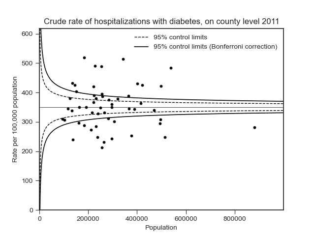

# Funnel Plots to present cross-sectional data on county level
In this repository you will find a Python script for creating Funnel Plots to present cross-sectional data (proportions, e.g. crude rates) on county level

Example:

MORE DOCUMENTATION WILL BE ADDED SOON
